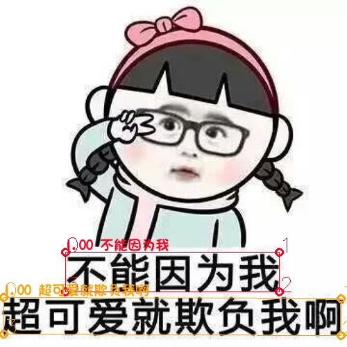
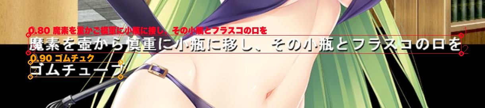
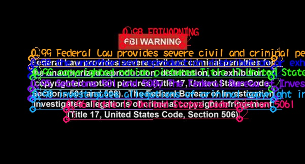
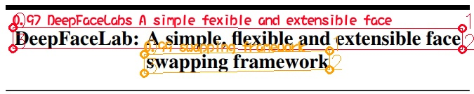
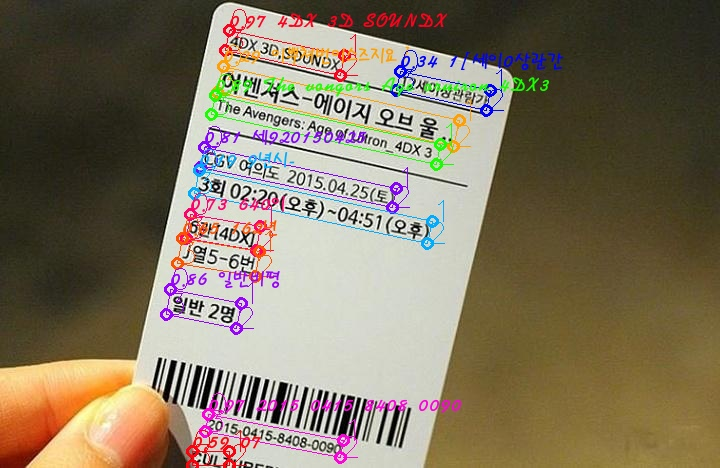

# Dango-OCR算法服务

#### 说明:
+  [DangoOCR](https://github.com/zhangming8/Dango-ocr)是一个开源的文字识别工具,通过调用的本算法服务实现文字识别。
+  本服务基于百度开源的[PaddleOCR](https://github.com/PaddlePaddle/PaddleOCR)，如果要部署自己模型请在该项目中的develop分支训练。
+  相关blog [使用飞桨一步步实现多语言OCR文字识别软件](https://blog.csdn.net/u010397980/article/details/111940566)

#### 环境:
+  python>=3.6, paddlepaddle-gpu >= 1.8.5
   
#### 训练模型：
+  模型包括检测模型、识别模型。训练过程可以[参考文档](https://github.com/PaddlePaddle/PaddleOCR/tree/develop/doc/doc_ch)
+  检测模型用的是DBnet, 所有的识别模型都用的是CRNN
    
#### 导出模型：
+  训练模型导出为inference模型(导出后不必重新定义网络结构，便于部署)，[参考](https://github.com/PaddlePaddle/PaddleOCR/blob/develop/doc/doc_ch/inference.md)

#### 部署/启动服务
+  修改config.py中的检测(det_model_dir)和识别模型(rec_model_dir)路径。其中不同语言的检测模型是共用的，识别模型需要单独训练。
+  目前所有语言的识别都没有使用方向模型，所以所有语言的use_angle_cls=False
+  执行./prod_deploy.sh启动服务。其中'reco_language'为检测模型后面并联的多个识别模型，'port'为算法服务的端口号
+  启动成功会在当前目录创建'log'文件夹，里面会记录启动的日志便于调试代码

#### 测试/调用服务
+  执行python test.py会读取'demo'文件夹内的图片并调用本服务，同时把结果保存在"deom_result"文件夹，如下图为几个示例

+ 结果 1

    

+ 结果 2

    

+ 结果 3

    

+ 结果 4

    

+ 结果 5

    

+ 结果 6

    

#### 参考：
+ OCR算法参考百度PaddleOCR: https://github.com/PaddlePaddle/PaddleOCR
+ 本OCR服务： https://github.com/zhangming8/ocr_algo_server
+ 最终OCR软件： https://github.com/zhangming8/Dango-ocr
